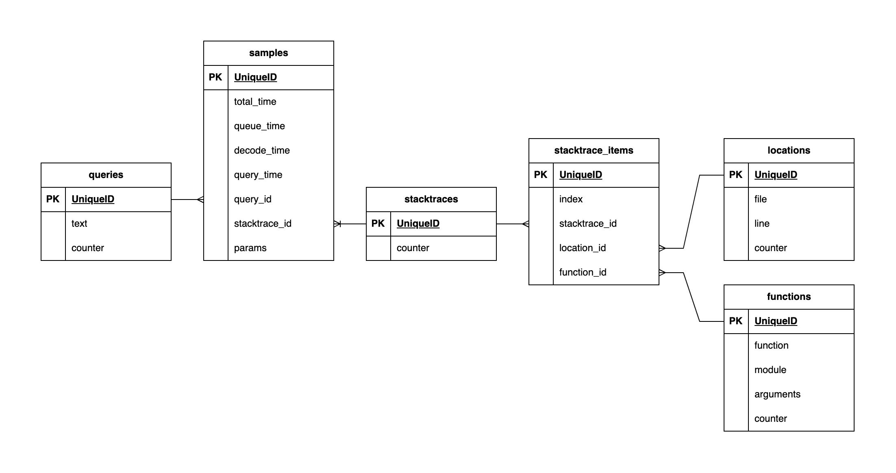

# EctoQueryExplorer

EctoQueryExplorer is a tool used to gather and analyse Ecto query telemetry.

> [!WARNING]
> EctoQueryExplorer is in its experimental stage. Use it at your own risk.

## Movivation

We've already identified a slow query and now want to be able to:

1. locate code that produced a slow database query,
2. run EXPLAIN for the query in question,
3. do 1 and 2 very fast.

We also want to be better understand a bigger picture: which code produces which queries, how often,
how much time time it takes for those queries to finish.

## Design

EctoQueryExplorer relies on query telemetry emitted by Ecto, specifically on stacktraces included in
telemetry. Stacktraces were added to telemetry in https://github.com/elixir-ecto/ecto/pull/3798.

EctoQueryExplorer uses an ETS table to collect samples, queries, params, code locations and MFAs.
Then EctoQueryExplorer saves collected data to SQLite3 to run analysis on top of.

SQLite3 schema looks like this:

[](https://hex.pm/packages/ecto)

### Caveats

* EctoQueryExplorer will not attempt to persist data across application restarts,
* subsequent dumping of data from ETS to SQLite3 database will override any existing data in SQLite3,
* usage in clustered environments have not been tested,
* the Readme file you're looking at is the only documentation right now.

## Installing

Installation boils down do installing `ecto_query_explorer` and configuring a new repository
to store the data.

Perform the following steps:

1. include the following line to `deps` list in `mix.exs`:

    ```elixir
    {:ecto_query_explorer, "~> 0.1"}
    ```

2. add a new repository module:

    ```elixir
    defmodule MyApp.EctoQueryExplorerRepo do
      use Ecto.Repo,
        otp_app: :my_app,
        adapter: Ecto.Adapters.SQLite3
    end
    ```

3. include the the following contents to `config/config.exs`:

    ```elixir
    # add EctoQueryExplorerRepo to the list of repositories
    config :my_app,
      ecto_repos: [MyApp.MyRepo, MyApp.EctoQueryExplorerRepo]

    # enable stacktraces in MyApp.MyRepo config
    config :my_app, MyApp.MyRepo,
      stacktrace: true

    # configure EctoQueryExplorerRepo
    config :my_app, MyApp.EctoQueryExplorerRepo,
      database: "/tmp/ecto-query-explorer-#{config_env()}.sqlite3"

    # tell ecto_query_explorer about EctoQueryExplorerRepo
    config :ecto_query_explorer,
      otp_app: :my_app,
      repo: MyApp.EctoQueryExplorerRepo,
      ets_table: :ets_query_explorer_data,
      source_ecto_repos: [
        MyApp.MyRepo
      ]
    ```

4. update `application.ex`, include repository and library setup:

    ```elixir
    # ...
    children = [
      MyApp.EctoQueryExplorerRepo,
      EctoQueryExplorer
    ]
    ```

5. create a database migration with the following contents:

    ```elixir
    # priv/ecto_query_explorer_repo/migrations/1_initial.exs
    defmodule EctoQueryExplorer.Repo.Migrations.Initial do
      use Ecto.Migration

      def up do
        EctoQueryExplorer.Migration0.up()
      end

      def down do
        EctoQueryExplorer.Migration0.down()
      end
    end
    ```

6. run migration:

    ```sh
    mix ecto.create --repo MyApp.EctoQueryExplorerRepo + migrate --repo MyApp.EctoQueryExplorerRepo
    ```

## Usage

Start your application, and keep it running to collect some query data. After a while, call:

```elixir
EctoQueryExplorer.Data.dump2sqlite()
```

If you'd like to store and analyse queries emitted by the test suite after it finishes, add the following
code to `test_helper.exs`:

```elixir
ExUnit.after_suite(fn _args ->
  EctoQueryExplorer.Data.dump2sqlite()
end)
```

After the SQLite3 database file is generated, you may use the library in 3 different ways.

### Using convenience functions

The following convenience functions are provided by EctoQueryExplorer:

* `EctoQueryExplorer.Queries.filter_by_query/1` - accepts a string containing a regular
  expression and returns a query with samples, including location data.

  See "[The LIKE, GLOB, REGEXP, MATCH, and extract operators](https://www.sqlite.org/lang_expr.html#the_like_glob_regexp_match_and_extract_operators)"
  for more details about the regular expressions.

  Example:

  ```elixir
  EctoQueryExplorer.Queries.filter_by_query("update%")
  ```

* `EctoQueryExplorer.Queries.filter_by_parameter/1` - use this one if you're looking for a query that was executing with a specific parameter value,

  Example:

  ```elixir
  user_id = "da06de53-34bb-4b6a-9f36-0e8478b05458"
  EctoQueryExplorer.Queries.filter_by_parameter(user_id)
  ```

  Notes:

  1. for a given query, parameters are saved only for 3 slowest samples,
  2. when calling this function, all stored parameters will fetched from the SQLite3 table and decoded using `:erlang.binary_to_term/1` function.

* `EctoQueryExplorer.Queries.filter_by_mfa/3` - return all queries, which were produced by stacktraces that contain given module, function and arity.

  Example:

  ```elixir
  EctoQueryExplorer.Queries.filter_by_mfa(User, :register, 1)
  ```

* `EctoQueryExplorer.Queries.filter_by_location/2` - return all queries, which were produced by stacktraces that contain given file and line number.

  Example:

  ```elixir
  EctoQueryExplorer.Queries.filter_by_location("lib/my_app/path/to/code/module.ex", 12)
  ```

* `EctoQueryExplorer.Queries.explain/1` - accepts query ID, and returns a map containing query plan. Can be used to produce JSON for tools like https://explain.dalibo.com.

  Example:

  ```elixir
  report = EctoQueryExplorer.Queries.explain(123_234_345)
  Jason.encode!(report) # JSON to be used for further analysis or plan visualisation
  ```

  Notes:

  * the query will be wrapped in a transaction, which is reverted after producing the `explain` report.
  * query the database using familiar Ecto queries. Examples:
  * query the file directly using `sqlite3` command line utility. Examples:

* `EctoQueryExplorer.Queries.top_queries/1` - accepts a number, returns a list of most popular queries ordered by count

### Using Ecto queries

### Using `sqlite3` CLI utility

Consider running the query using `.mode table` and `.width auto` for nicer outputs. Run queries like this:

```sh
sqlite3 -cmd ".mode table" -cmd ".width auto 160" /tmp/ecto-query-explorer-prod.sqlite3 'query string'
```

Here are some examples:

1. get top 5 most popular queries:

    ```sql
    select counter, text from queries order by counter desc limit 5
    ```

2. get top 5 most popular stacktraces:

    ```sql
    select id from stacktraces order by counter desc limit 5
    ```

3. find all queries that have at least 25 parameters in them:

    ```sql
    select id, text from queries where text like '%$25%' order by counter desc limit 5
    ```

## License

EctoQueryExplorer is licensed under MIT license. See [LICENSE](LICENSE) for more details.
